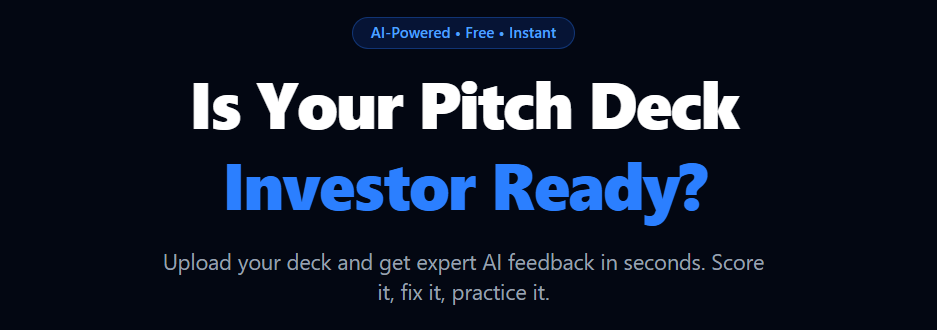
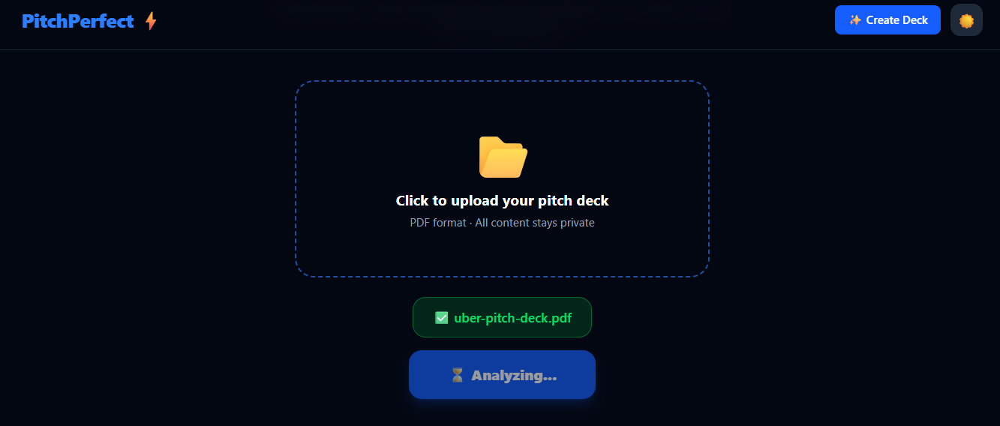
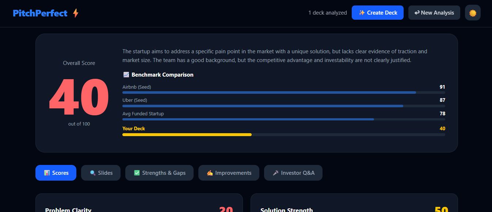
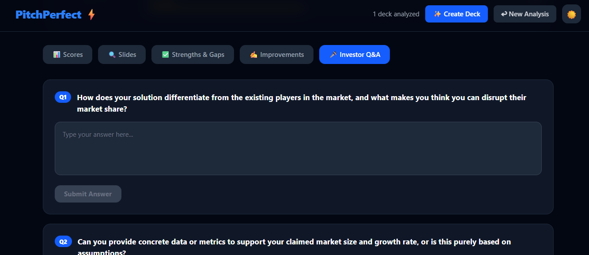
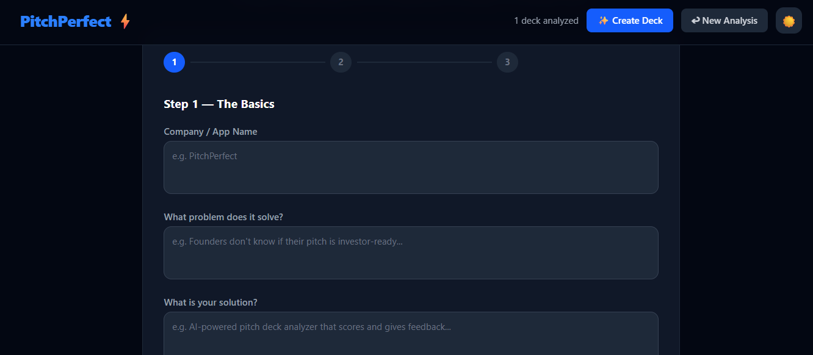

# PitchPerfect ⚡
### AI-Powered Startup Pitch Deck Analyzer

> "Upload your deck. Know your odds."

🔗 **Live App:** https://pitchperfect-blond.vercel.app/



---

## 🚀 What is PitchPerfect?

PitchPerfect is an AI-powered web app that analyzes startup pitch decks and gives instant, expert-level feedback — like having a senior investor review your deck for free.

Upload your PDF → Get scored across 8 investor dimensions → Fix weak slides → Practice investor Q&A → Build a new deck from scratch.

---

## ✨ Features

| Feature | Description |
|---------|-------------|
| 📊 **8-Dimension AI Scoring** | Scored across Problem, Solution, Market, Business Model, Traction, Team, Competition, Investability |
| 🔍 **Slide-by-Slide Feedback** | Every slide rated 🟢🟡🔴 with specific feedback |
| ✍️ **AI Rewrite Suggestions** | Get improved versions of your weakest slides |
| 🎤 **Investor Q&A Simulator** | Practice tough investor questions based on your actual deck |
| 📈 **Benchmark Comparison** | Compare your score against Airbnb and Uber seed decks |
| ✨ **Pitch Deck Creator** | Build a complete 12-slide deck from scratch with AI |
| 🌙 **Dark / Light Mode** | Clean UI in both themes |

---

## 📸 Screenshots

### Landing Page


### AI Scoring Dashboard


### Slide-by-Slide Feedback


### Investor Q&A Simulator


### Pitch Deck Creator


---

## 🛠️ Built With

- **Frontend** — React + Vite + Tailwind CSS
- **AI** — Hugging Face Inference API (Llama 3.1 8B)
- **PDF Parsing** — PDF.js
- **Hosting** — Vercel

---

## 📦 Run Locally

```bash
